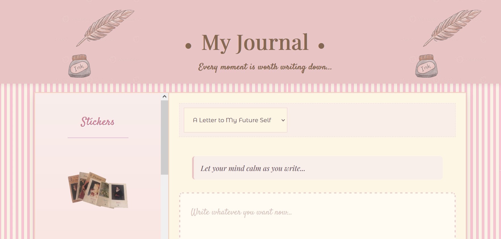
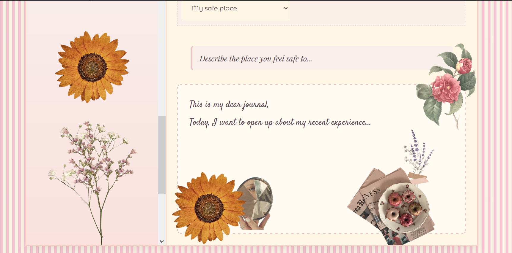

# Journal Sticker Demo (Javascript + CSS sticker animation)

## What It Does

This is a tiny, single-page journal where you can:
- Choose a writing theme to get inspired
- Drag stickers into your note
- Throw those same stickers into the trash as preferred 
- A playful interface 

### Purpose Of The Page

This isn't a full-featured app. It's a **demo**. A project built to showcase:
- JavaScript DOM manipulation
- Drag-and-drop logic
- Simple user interaction
- Aesthetic layout and font usage

## Future Plans 

Features to be updated:
- **Persistent journals**: Save your entries to a database
- **User accounts**: Log in and manage your own private journals
- **Dark mode**: Convenient to use during nighttime.
- **More stickers & sticker packs**: Grouped in categories
- **Autosave**: Prevents data loss.
- **Mobile optimization**: Journal on-the-go
- **Privacy options**: Lock your notes, share only what you want

## 🛠 Tech Stack

- HTML
- CSS
- JavaScript

## Screenshots

## 🚧 Limitations

- Only one static page
- No saving or database functionality
- No user login
- Stickers are limited and not customizable (yet)
